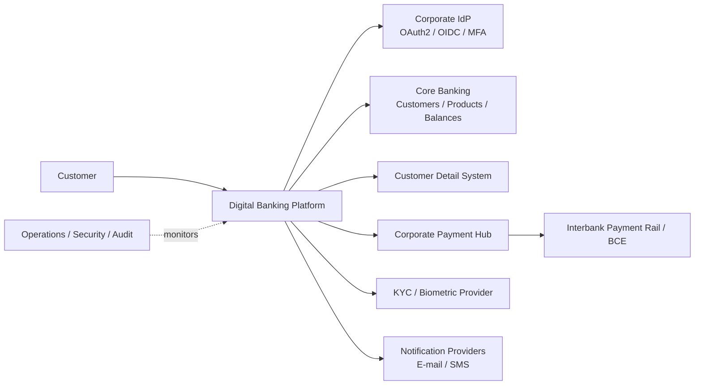
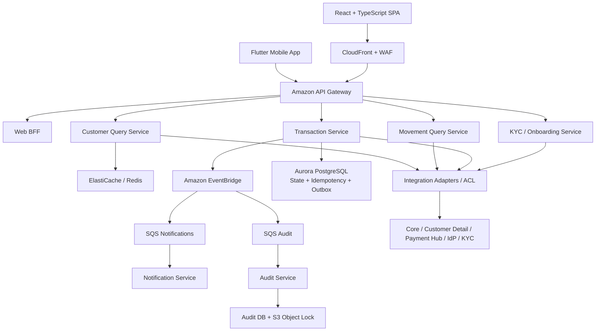
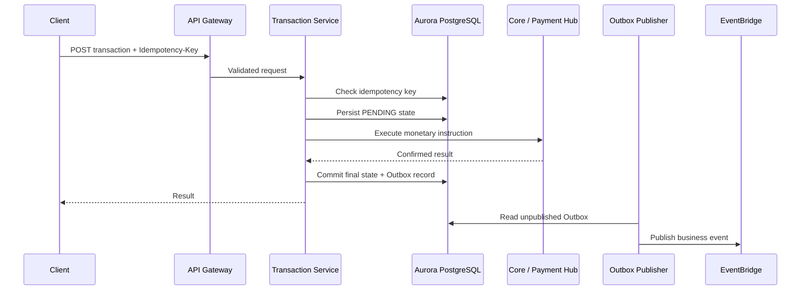
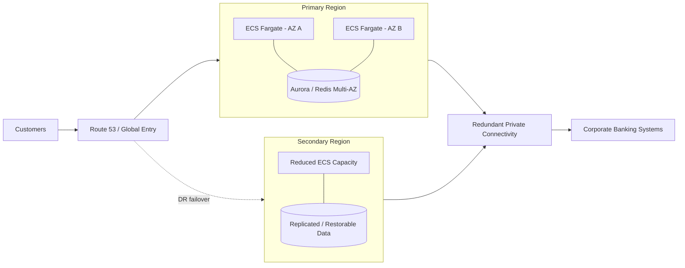

# AWS Digital Banking Architecture

### Solution Architecture Case Study | AWS | C4 | ADD 3.0 | Security | Resilience | Event-Driven Integration

A portfolio case study showing how I design a **secure and resilient digital-banking platform on AWS** from architectural drivers and business constraints—not from a predefined technology stack.

The design keeps the **Core Banking System and other corporate platforms as systems of record** while adding a digital experience and integration layer for web/mobile channels, transactions, onboarding, notifications, audit and observability.

> **Portfolio disclaimer:** this is an independent architecture exercise for professional demonstration. It is not an official, deployed or approved architecture of any financial institution. Scenario identifiers such as “BP” are retained inside the original diagrams. Production use would require formal validation of BIA/RTO/RPO, workload sizing, AWS Region, security, privacy, contracts and current regulatory requirements.

---

## What this project demonstrates

- **Attribute-Driven Design (ADD 3.0)** and Architecturally Significant Requirements (ASRs)
- **C4 architecture** from System Context to Components
- **Architecture Decision Records (ADRs)** with alternatives and trade-offs
- AWS cloud architecture, hybrid connectivity and multi-account governance
- OAuth 2.0 / OIDC, BFF, PKCE, MFA and biometric onboarding separation
- Transactional consistency using idempotency, durable state and **Transactional Outbox**
- Event-driven integration using **EventBridge + SQS + DLQ**
- Anti-Corruption Layer around legacy/core banking systems
- Multi-AZ availability and **warm-standby multi-region DR**
- Business audit, immutable evidence, observability and security controls
- Explicit management of assumptions, unknowns and production risks

---

## Business context

The target digital platform supports:

- Customer/product queries and account movements
- Transfers and payments
- Web and mobile banking
- OAuth 2.0 / OpenID Connect authentication
- Biometric onboarding / KYC
- Business audit trail
- Independent e-mail and SMS notifications
- High availability, DR, monitoring and auto-healing
- Integration with Core Banking, customer-detail, IdP, KYC and payment systems

The architecture **does not replace the Core Banking System**. It acts as an experience, orchestration and integration layer around authoritative enterprise systems.

---

## System context

**Design principle:** the digital layer consumes and protects existing banking capabilities instead of exposing legacy systems directly to Internet-facing channels.

---

## Target solution architecture

### Main technology decisions

| Area | Decision |
|---|---|
| Cloud | AWS |
| Runtime | Amazon ECS on Fargate, Multi-AZ |
| Web | React + TypeScript + S3/CloudFront + Web BFF |
| Mobile | Flutter baseline; React Native remains an organizational alternative |
| Identity | OAuth 2.0 / OIDC + Authorization Code + PKCE + MFA/step-up |
| API layer | Amazon API Gateway |
| Legacy integration | Adapters + Anti-Corruption Layer |
| Async integration | Amazon EventBridge + SQS + DLQ |
| Transaction persistence | Aurora PostgreSQL owned by Transaction Service |
| Cache | ElastiCache / Redis using Cache-Aside |
| Reliable events | Idempotency + Transactional Outbox |
| Audit | Business Audit Service + audit store + S3 Object Lock |
| Primary availability | Multi-AZ |
| DR | Warm standby hypothesis; final tier driven by BIA/RTO/RPO |
| Hybrid connectivity | Redundant Direct Connect / Hosted Connection + IPSec VPN backup |
| Governance | AWS Organizations / Landing Zone + IaC + CI/CD |

---

## Transaction consistency: the critical design problem

A monetary operation must not be duplicated just because the network response is uncertain.

If the Core/payment hub times out with an **unknown outcome**, the platform records `UNKNOWN` / `PENDING_RECONCILIATION` and reconciles using a stable business reference. It does **not** blindly repeat the monetary instruction.

This is one of the central architectural decisions in the case study.

---

## Security model

The design applies controls across multiple layers:

- **Identity:** OIDC/OAuth 2.0, PKCE, MFA/step-up, passkeys, least privilege
- **Web session:** BFF pattern; `Secure`, `HttpOnly`, `SameSite` cookies; no OAuth tokens in browser localStorage
- **API:** API Gateway, WAF, throttling, contract validation and authorization policies
- **Network:** private workloads, security groups, hybrid connectivity and TLS
- **Data:** KMS, Secrets Manager, minimization and encrypted backups
- **Application:** OWASP ASVS/MASVS, SAST, SCA, DAST, secret/image scanning
- **Detection:** GuardDuty, Security Hub, CloudTrail, AWS Config and corporate SIEM
- **Audit:** business audit is separated from operational logs and AWS control-plane logs

---

## AWS availability and disaster recovery

Warm standby is a **design hypothesis**, not a fabricated requirement. Final capacity, replication and failover targets must come from an approved Business Impact Analysis and RTO/RPO objectives.

---

## Architecture decisions

The case study documents **18 major ADRs**, including AWS platform selection, runtime, web/mobile patterns, identity, API entry, legacy integration, async messaging, transactional persistence, cache, reliable event delivery, audit, DR, connectivity, notifications, Landing Zone and IaC.

➡️ **[Read the full ADR matrix](docs/architecture-decisions.md)**

➡️ **[Review ASR → pattern → technology traceability](docs/asr-traceability.md)**

---

## Editable C4, sequence and deployment diagrams

The original architecture contains **16 editable Draw.io views**:

1. C4 Level 1 — System Context
2. C4 Level 2A — Channels and Access
3. C4 Level 2B — Application Services
4. C4 Level 2C — Data and Messaging
5. C4 Level 2D — External Integrations / ACL
6. C4 Level 3 — Transaction Service
7. C4 Level 3 — Onboarding / KYC
8. Web Authentication — BFF sequence
9. Mobile Authentication — PKCE sequence
10. Successful Transaction sequence
11. Timeout & Reconciliation sequence
12. Cache-Aside sequence
13. AWS Landing Zone & Governance
14. Primary Region — Multi-AZ & Hybrid Connectivity
15. Disaster Recovery — Warm Standby
16. End-to-End Observability

➡️ **[Open the editable diagram index](docs/diagram-index.md)**

---

## Documentation

| Resource | Purpose |
|---|---|
| **[Full Architecture Case Study](docs/full-architecture-report.md)** | Complete portfolio narrative: requirements, drivers, architecture, flows, AWS deployment, security, regulation, cost and risks |
| **[Architecture Decision Matrix](docs/architecture-decisions.md)** | 18 ADRs with alternatives and trade-offs |
| **[ASR Traceability](docs/asr-traceability.md)** | Driver → pattern/tactic → design consequence → technology |
| **[Open Risks & Production Preconditions](docs/open-risks.md)** | What must be validated before production |
| **[Diagram Index](docs/diagram-index.md)** | 16 editable Draw.io architecture views |
| **[Disclaimer](DISCLAIMER.md)** | Portfolio / non-production scope |

---

## Open production decisions

A professional architecture should not invent missing requirements. This design therefore keeps the following explicitly open:

- AWS Region and measured Ecuador → AWS → Core latency
- BIA, RTO and RPO by business capability
- TPS, concurrency and capacity sizing
- Real IdP capabilities and provisioning model
- Corporate payment-hub behavior and reconciliation rules
- Regulatory/contractual cloud approval
- Personal-data and cross-border-processing model
- Biometric impact assessment and retention policy
- DevSecOps/SRE operational maturity

➡️ **[See the production preconditions](docs/open-risks.md)**

---

## Architecture philosophy

> Technology is selected as a consequence of architectural drivers—not as the starting point of the design.

**Context & requirements → ASRs & drivers → patterns/tactics → decisions → technologies → C4 / ADR → evaluation & iteration**

---

## Author

**Milton Quintana**  
IT Infrastructure & Solutions Leader | Solution & Cloud Architecture | AWS / Azure | Technical Pre-Sales

[GitHub Profile](https://github.com/mquintanaarboleda-gif)
